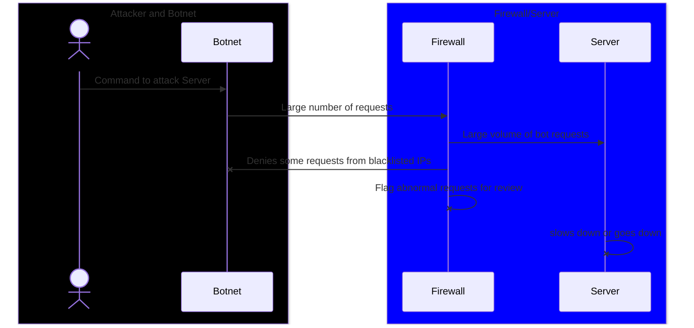

# Overview of _Distributed Denial of Service (DDoS)_ Attacks

### An explanation of _Distributed Denial of Service_ Attacks
1. An attacker directs a botnet to attack a server
    * a botnet is made up of many computers that have been compromised and can be used by the attacker
2. The botnet begins sending a large number of requests to the server
3. A firewall acts as a gatekeeper, and begins inspecting requests. The firewall may:
    * Deny some requests, preventing server access
    * Flag some requests as suspicious and not allow access
    * Allow requests through to the server
4. Due to the large number of requests being sent by the botnet the server:
    * Slows while trying to handle the large volume of successful requests
    * May be unable to handle the volume of requests and may crash if completely

